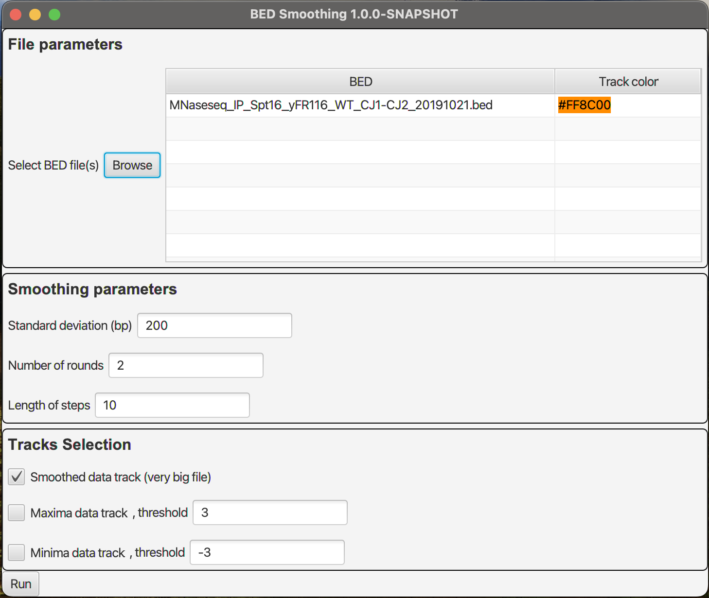

Smoothing
=========

Smoothes BED files.


## Interface




## File Parameters

You must select at least one BED file. Smoothing does not support other formats at the moment.

If the selected BED file has a `track` line with `color`, the `color` will be selected as the `color` of the
output file.
You can change the `color` of the output BED file's track by clicking on the shown color in the second column.

The `name` and `description` of the track will be updated to show that it was smoothed and the `description` will
include the smoothing parameters.


## Smoothing Parameters

### Standard Deviation

Standard deviation of the gaussian used for the filter.

### Number of Rounds

Number of times the smoothing is applied to the data. A greater number will generate a smoother curve.

### Length of Steps

Spacing between the middle coordinates of data in the output file.
A length of 10 will generate a BED file looking like this:
```text
chrI	605	615	0.0867
chrI	615	625	0.0868
chrI	625	635	0.0869
```


## Track Selection

### Smoothed Data Track

Outputs a smoothed version of the input BED containing all data points.
This file can be very big, especially if the `Length of steps` is small.

### Maxima Data Track

Outputs a smoothed version of the input BED containing only the points with the biggest scores.

#### Threshold - Maxima

The thresholds used to find local maximums (of 7 consecutive datapoints)

### Minima Data Track

Outputs a smoothed version of the input BED containing only the points with the lowest scores.

#### Threshold - Minima

The thresholds used to find local minimums (of 7 consecutive datapoints) - should be a negative value
